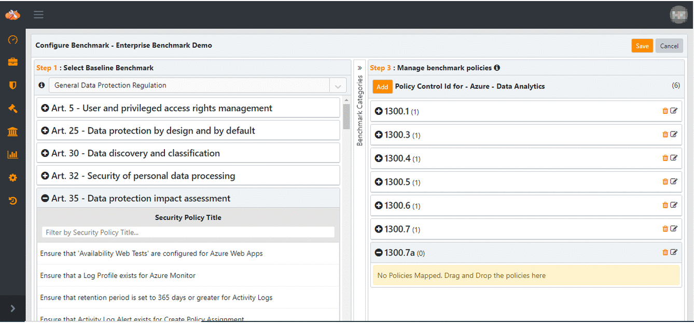

Private Benchmark
====================

Overview
--------

Cloudneeti offers functionality/feature to create Private benchmark, private
to their Organization or Business Unit. Enterprises can build and manage their
own internal Information Security benchmark by either deriving from an existing
baseline of Cloudneeti supported benchmarks or by creating completely on your
own.

The following steps are done by Cloudneeti application **License Admin** role.

STEP 1 Create Private Benchmark
---------------------------

Add basic details for Private Benchmark.

1.  Click **Configurations**

2.  Navigate to **Private Benchmarks**

    

3.  Give **Name, Title, Long Name, Logo** and choose **Connector Type** for
    Benchmark to be created

    

    Note : Benchmark configuration can be done using categories and policies for
    chosen connector type only.

4.  **Save** and continue to configure the benchmark.

STEP 2 Configure Private Benchmark
------------------------------

Private Benchmark can be configured mapping policies to existing or new
categories. Cloudneeti allows custom control ids for mapping policies into a
category.

Repeat below steps to map, update categories and policies from baseline benchmarks.

### 2.1 Category Configuration

Private Benchmark can be configured by adding new categories and/or existing
from baseline benchmarks.

#### 2.1.1 Select baseline benchmark to drag and drop existing categories

1.  Drag and drop categories

    

#### 2.1.2 Create category

1.  Click **Add** to create a Benchmark category

    

2.  Enter **Category Name**

    

3. Category will be added in the private benchmark

    

#### 2.1.3 Update mapped categories

1. Click on **edit icon**

    

2. Update benchmark category name

    

#### 2.1.3 Remove category 

Click on **bin icon** to remove benchmark category, this will remove all related control ids and mapped policies within this category.

### 2.2 Policy Configuration

#### 2.2.1 Add control number

Control number created can be mapped with one or more policies using below
steps.

1. Select category

2. **Add** control number

    

3. Enter control number

    

#### 2.2.2 Select policies from baseline benchmark and drag and drop policies

1. Select baseline benchmark and expand category to select policy.

2. Drag and drop policies in desired control id to map with private benchmark.

    

#### 2.2.3 Update control id

Click on edit icon to update control id
 

#### 2.2.4 Delete control id

Click on bin icon to delete control id, this will remove mapped policies within this control id.
 

#### 2.2.5 Update policy title

Double click on mapped policy to update the Policy Title
 

#### 2.2.6 Remove policy

Use bin icon to removed mapped policy
 

STEP 3 Associate Private Benchmark with License/Licenses
---------------------------------------------------------

Private Benchmark can be associated with License/Licenses having private benchmark feature, User is License Admin for.

Note : Private Benchmark summary will be effective for Cloud Accounts of
connector type chosen on Benchmark creation.

### Associate with an active License 

Private benchmark once associated with Cloudneeti License, Private
benchmark summary of Cloud Account will be available post next successful scan.

### Disassociate from License

Private benchmark once de-associated with Cloudneeti License, Private
benchmark summary of Cloud Account will not be available post next successful
scan.

### 3.1 Steps

1. Navigate to **Private Benchmark** page 

2. Click **Associate**

    

3. Select and move license to section **Associate with Licenses** to associate and move to **Disassociate with Licenses**

    Example : Move license Cloudneeti Demo and Cloudneeti Test to associate
    

4. **Save**

    

5. Benchmark summary page will appear on next successful scan

    

Collaborate with users for Private Benchmark configuration
----------------------------------------------------------

License Admins can collaborate for configuration of Private Benchmark.
Collaborated users can Edit, Collaborate, remove Collaboration, Associate and
De-associate Private Benchmark.

### Collaboration with users

License Admin can collaborate with other License Admins of License having private benchmark feature, User is License Admin for. 

Collaborated License Admins can update, configure, associate and collaborate Private Benchmark.

### Steps

1. Navigate to **Private Benchmark** page 

2. Click **Collaborate**

    

3. Select and move users to section **Collaborate with** to collaborate and move to **Available for collaboration** to remove collaboration.

    

4. Click **Collaborate Now** 

    

Update Private Benchmark
---------------------------

Private benchmark can be updated for basic details as well as configurations.

### Update Private Benchmark basic details

1. Navigate to **Private Benchmark** page 

2. Click **Update**

    

3. Update benchmark long name, title logo and **Save**

    

### Update Private Benchmark configuration 

Please follow  [steps under Step 2](.././administratorGuide/#step-2-configure-private-benchmark)

<!-- Clone Benchmark
---------------

>   **\<Steps and Screenshot Here\>**
