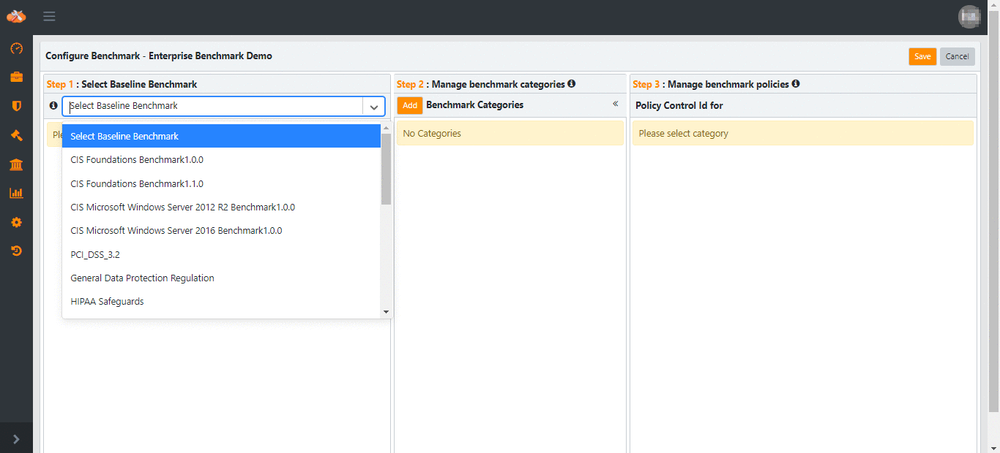
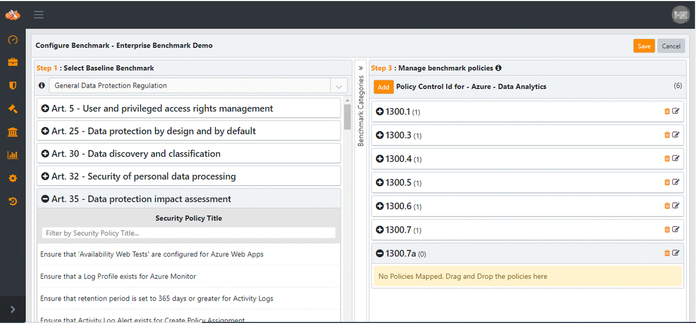

Private Compliance Benchmark
============================

Overview
--------

Cloudneeti License Admin can create a Private Benchmark. Companies can use Private Benchmark to select security policies relevant for their organization. Private benchmark can be defined from individual security policies, but it can also be based on an existing compliance benchmark as a starting point and then modified as appropriate.

The following steps are done by Cloudneeti application **License Admin** role.

| **S. No.** | **Step**                                    | **Portal to use** | **Role**      |
|------------|---------------------------------------------|-------------------|---------------|
| 1          | Create Private Benchmark                    | Cloudneeti        | License Admin |
| 2          | Configure Private Benchmark                 | Cloudneeti        | License Admin |
| 3          | Associate Private Benchmark with License(s) | Cloudneeti        | License Admin |
| 4          | Collaborate with other License Admins       | Cloudneeti        | License Admin |

STEP 1: Create and Update Private Benchmark
-------------------------------------------

### 1.1 Create Private Benchmark 

Add basic details for Private Benchmark.

1.  Click **Configurations**

2.  Navigate to **Private Benchmarks**

    

3.  Give **Name, Title, Long Name, Logo** and choose **Connector Type** for
    Benchmark to be created

    

    Note : Private Benchmark configuration can be done for one selected connector type only.
    chosen connector type only.

4.  **Save** and continue to configure the benchmark.

### 1.2 Update Private Benchmark

1. Navigate to **Private Benchmark** page 

2. Click **Update**

    

3. Update benchmark long name, title logo and **Save**

    

STEP 2 Configure Private Benchmark
----------------------------------

Private Benchmark is configured by defining specific to this benchmark categories and security policies. 
Cloudneeti allows custom control ids for mapping policies into a category.

Repeat below steps to map, update categories and policies from baseline benchmarks.

### 2.1 Category Configuration

Private Benchmark can be configured by reusing existing categories from an existing benchmark (baseline benchmark) and/or by adding new categories.

#### 2.1.1 Reuse existing categories

Select baseline benchmark to drag and drop existing categories

1.  Select Baseline Benchmark

2.  Drag and drop categories

    

#### 2.1.2 Adding new categories

1.  Click **Add** to create a new category

    

2.  Enter **Category Name**

    

3. A category will be added in the Private Benchmark

    

#### 2.1.3 Update a category

1. Click on **edit icon**

    

2. Update category name and click **Save**

    

#### 2.1.4 Remove a category 

Click on **bin icon** to remove benchmark category. This will remove all the security policies (including control ids) mapped under this category.

### 2.2 Configure Control Numbers

#### 2.2.1 Add control number

1. Select category

2. Click **Add** control number

    

3. Enter control number

    

#### 2.2.2 Update control id

Click on edit icon to update control id
 

#### 2.2.3 Delete control id

Click on bin icon to delete control id, this will remove mapped policies within this control id.
 

### 2.3 Policy Configuration

#### 2.3.1 Reuse existing security policies

1. Select baseline benchmark 

2. Expand category to see existing secuirty policy within the baseline benchmark.

2. Drag and drop security policies under desired control number.

    

#### 2.3.2 Update security policy

1. Double click on mapped security policy 

2. Update security Policy title
 
    

#### 2.3.3 Remove policy

Use bin icon to removed mapped policy
 

STEP 3 Associate Private Benchmark with License(s)
--------------------------------------------------

Private Benchmark can be associated with License(s) where private benchmark feature is enabled. 

Private Benchmark views and reports will be available for Cloud Accounts that match the selected connector type

### 3.1 Associate with an active License 
Private benchmark need to be associated with specific Cloudneeti License(s). Private benchmark menu entry, views and reports will be available after a successful rescan.

1. Navigate to **Private Benchmark** page 

2. Click **Associate**

    

3. Select and move license to section **Associate with Licenses** 

    
    Example : Move license Cloudneeti Demo and Cloudneeti Test to associate

4. Click **Save**

    

5. Initiate a **rescan** for selected connector type cloud account in associated License 
    
    

6. Benchmark summary page will appear on next successful scan

    

Collaborate with users for Private Benchmark configuration
----------------------------------------------------------

License Admins can collaborate for configuration of Private Benchmark.
Collaborated users can Edit, Collaborate, remove Collaboration, Associate and
De-associate Private Benchmark.

## STEP 4: Collaboration with users

License Admins can collaborate with other License Admins for configuring Private Benchmark and associating it with different Licenses. Added License Admins can do all the same operations (Edit, Collaborate, remove Collaboration, Associate and Disassociate) on Private Benchmarks as the License Admin who created Private Benchmark. 

### 4.1 Add License Admins for Collaboration 

License Admin can add License Admins of Licenses where Private Benchmark feature is enabled.

1. Navigate to **Private Benchmark** page 

2. Click **Collaborate**

    

3. Select and move users to section **Collaborate with** to collaborate and move to **Available for collaboration** to remove collaboration.

    

4. Click **Collaborate Now** 

    

